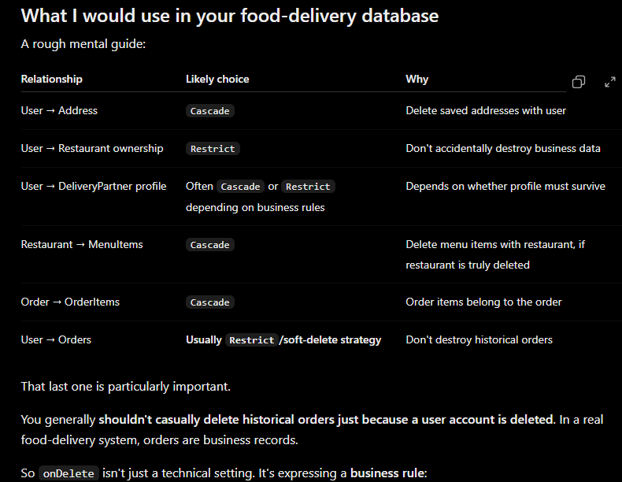

Day 1: 

We are about to start, this app will develop from nonolith to microservice as the work progresses.

Day 2: 

Since we are to use a SQL DB, Im learning to set up Prisma 

Startup
1. npm run dev runs nodemon server.js; npm start runs node server.js.
2. [server.js](C:/Tomato/server.js) loads variables from .env.
3. It dynamically imports src/index.js. That import happens after the environment load.
4. [src/index.js](C:/Tomato/src/index.js) imports the Express app and starts listening on PORT, defaulting to 8000.
5. [src/app.js](C:/Tomato/src/app.js) creates the app, registers CORS, JSON, URL-encoded body, and cookie middleware, then defines GET /health.
Database flow
[src/config/db.js](C:/Tomato/src/config/db.js) creates a MariaDB adapter using the DB_HOST, DB_PORT, DB_USER, DB_PASSWORD, and DB_NAME variables, then passes it to Prisma Client. The client and connection pool are created during startup; the actual database connection is generally needed when a query runs.
For GET /health, the route runs SELECT 1 through Prisma. It returns 200 if that query succeeds and 500 if it fails.
Prisma reads the model definitions from [schema.prisma](C:/Tomato/prisma/schema.prisma). The migration in prisma/migrations/20261004183828_init/migration.sql creates the User table and its unique indexes.
Other commands
- npm run db:generate generates the Prisma Client into src/generated/prisma.
- npm run db:migrate runs Prisma’s development migration command.
- npm run db:studio opens Prisma Studio.
- node src/test-db.js runs the read-only database probe. This file loads .env itself.
- node src/test-user.js runs create/read/update/delete examples. Unlike the database probe, it does not load .env itself, so run it through a process that loads the environment or add dotenv loading before running it directly.

Day 3:

Today we are making models to store in our DB
-> We learnt that first make your complete flow of DB then write it in prisma(pretty similar to mongo DB), then

run these commands:

npx prisma format    (likhe hue ko acchese formatting krega)
npx prisma validate  (dekhega ki kya ye sachmei valid schema haina)
npx prisma migrate dev --name init   (mere blueprint se actual table bnegi migrate hoke)

Now those tables will be automatically written in MySQL and will be saved in your server.

All the models as of now :
1. User
2. Address
3. Restaurant
4. MenuCategory
5. MenuItem
6. Cart
7. CartItem
8. Order
9. OrderItem
10. Payment
11. DeliveryPartner
12. DeliveryAssignment
13. DeliveryLocation
14. Notification

Here is the full DB stucture Im planning to make:

DAY-4:

I actually learnt the Prisma way(syntax) to write DB schema.
?-> can be NULL
enum can be defined seperately
Ondelete is important.

