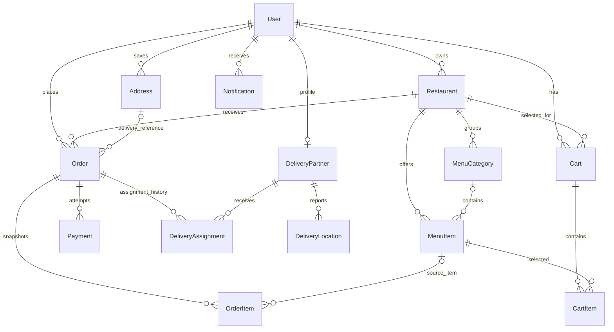

# Tomato database design

This document describes the first database for Tomato's food-delivery monolith. It implements the core data model suggested by the project plan: users, restaurants and menus, carts, orders, payments, delivery partners and live location history, and notifications. These are tables in one MySQL database accessed by the same Express application through Prisma.

The canonical model definitions live in [`prisma/schema.prisma`](../prisma/schema.prisma). The original user-table migration is retained, and [`20261006120000_food_delivery_core`](../prisma/migrations/20261006120000_food_delivery_core/migration.sql) adds the rest. Migrations are versioned database changes; do not edit an already-applied migration to represent a new change.

## Entity map



`||` means exactly one, `o|` means zero or one, and `o{` means zero or many. The Prisma relations below are backed by foreign keys in MySQL.

## Tables and keys

All tables use a generated primary key named `id`. Foreign keys use the referenced table's `id`; fields ending in `Id` are therefore the join keys. `createdAt` and `updatedAt` are lifecycle timestamps where provided. Amounts use fixed-precision `Decimal`, never floating point.

| Table | Important fields and keys | Purpose |
| --- | --- | --- |
| `User` | `id` PK; `email` unique; `phoneNumber` unique nullable; `role` | Customer, restaurant owner, delivery partner, or admin login identity. `password` stores a password hash, never plaintext. |
| `addresses` | `id` PK; `userId` FK → `User.id` | A user's saved delivery destinations, including coordinates. One user can save multiple addresses. |
| `restaurants` | `id` PK; `ownerUserId` FK → `User.id`; `status` | Restaurant profile, searchable location, owner, and order-taking state. |
| `menu_categories` | `id` PK; `restaurantId` FK → `restaurants.id`; unique (`restaurantId`, `name`) | A restaurant's ordered menu sections. |
| `menu_items` | `id` PK; `restaurantId` FK → `restaurants.id`; nullable `categoryId` FK → `menu_categories.id`; `price` | A sellable menu item, availability, image URL, and optional flexible metadata. |
| `carts` | `id` PK; `userId` FK → `User.id`; `restaurantId` FK → `restaurants.id`; `status` | A user's working selection for one restaurant. The app should keep an active cart tied to one restaurant at a time. |
| `cart_items` | `id` PK; `cartId` FK → `carts.id`; `menuItemId` FK → `menu_items.id`; unique (`cartId`, `menuItemId`) | Item and quantity in a cart. Quantity changes update the existing row. |
| `orders` | `id` PK; `userId` FK → `User.id`; `restaurantId` FK → `restaurants.id`; nullable `addressId` FK → `addresses.id`; `status`, totals | The placed purchase, monetary breakdown, timeline, and delivery-address snapshot. |
| `order_items` | `id` PK; `orderId` FK → `orders.id`; nullable `menuItemId` FK → `menu_items.id`; item name/price/quantity snapshots | Immutable-at-checkout lines. Snapshot values preserve what was bought if the menu later changes or an item is removed. |
| `payments` | `id` PK; `orderId` FK → `orders.id`; unique nullable `providerPaymentId`, unique nullable `idempotencyKey`; `status`, `method`, amount | Payment attempts and provider references. One order can have more than one attempt. Never store card numbers or security codes here. |
| `delivery_partners` | `id` PK; unique `userId` FK → `User.id`; current location and `status` | Delivery-specific profile for a user. A profile belongs to exactly one user. |
| `delivery_assignments` | `id` PK; `orderId` FK → `orders.id`; `deliveryPartnerId` FK → `delivery_partners.id`; status/timestamps | Assignment history. Keeping attempts as separate rows lets the app reassign an order without overwriting who previously accepted or rejected it. |
| `delivery_locations` | `id` PK (`BigInt`); `deliveryPartnerId` FK → `delivery_partners.id`; coordinates and `recordedAt` | Append-only location samples for tracking and history. |
| `notifications` | `id` PK (`BigInt`); `userId` FK → `User.id`; type, content, nullable `readAt` | In-app notification history, with optional structured payload. |

## Main relationship paths

- **Browse:** `Restaurant → MenuCategory → MenuItem`. A menu item also has a direct `restaurantId`, so restaurant menu queries are simple and the database can enforce the restaurant relation. The app must ensure the category, if supplied, belongs to that same restaurant.
- **Cart:** `User → Cart → CartItem → MenuItem`, with each cart tied to one restaurant. Prices shown in a cart are read from the current menu. Recheck item availability and price when checking out.
- **Place an order:** `User → Order → OrderItem`; `Order.restaurantId` identifies the restaurant that fulfills it. `Order.addressId` points to the saved address when it still exists, and `deliveryAddress` stores the checkout-time copy. `OrderItem.menuItemId` is nullable so the historical line survives menu-item deletion; its `itemName`, `unitPrice`, and `quantity` are the purchase record.
- **Pay:** `Order → Payment`. Each payment is an attempt with its own status and external provider reference. Store only provider identifiers and safe diagnostic text, not payment credentials.
- **Deliver:** `Order → DeliveryAssignment → DeliveryPartner → User`. Assignment rows record reassignments; `DeliveryLocation` records partner coordinates over time. The partner table also keeps the latest coordinate for quick proximity lookup.
- **Notify:** `User → Notification`. `data` can identify related records such as an order without adding a hard foreign key for each notification type.

## Constraints and responsibilities

Foreign keys protect parent-child references. Delete behavior is intentional: addresses, carts, and notifications follow their user; menu categories/items follow their restaurant; orders and payments are restricted from deletion so purchase history is not casually erased. Removing a menu category leaves its items uncategorized, and removing a menu item leaves the order snapshot intact. Prefer deactivation/status changes over deleting restaurants, menu items, and user accounts once they have history.

Some rules span multiple rows and are enforced by the application within database transactions:

1. A cart contains items only from its `restaurantId`; an order's items must also be from its restaurant.
2. A user's `addressId` must refer to an address owned by that user. Copy its delivery data into `deliveryAddress` at checkout.
3. Recompute cart prices, subtotal, fees, tax, discounts, and total on the server at checkout; never trust client-supplied totals. Ensure the order total equals its components.
4. Coordinate the order and payment state transitions idempotently. Use `idempotencyKey` for payment requests and the provider's unique payment ID when available.
5. Prevent two active assignments for the same order and enforce only one active cart per user in transaction/business logic. The schema indexes make lookups fast but do not by themselves enforce those conditional uniqueness rules.
6. Validate positive item quantities and nonnegative prices/fees, and authorize restaurant owners and delivery partners against the relevant rows.

The schema deliberately uses a string for `User.role` to allow role growth during learning; application constants/validation should restrict accepted values. The other lifecycle states are Prisma/MySQL enums so accidental values are rejected. Image files belong in object storage later; the database stores their URL. Search indexing, Redis/GeoHash, Kafka, WebSockets, and a payment gateway are future integrations from the sketch, not required to run this first database.

## Apply the schema

The app's runtime adapter reads `DB_HOST`, `DB_PORT`, `DB_USER`, `DB_PASSWORD`, and `DB_NAME` from the root `.env`. Prisma's CLI reads `DATABASE_URL` from that same file via `prisma.config.ts`. Set both to the same database before running commands. Keep `.env` private and use `.env.example` as the variable-name reference.

```bash
npm run db:generate
npm run db:migrate -- --name food_delivery_core
```

The checked-in migration is generated from the schema difference against the original `User` model and is ready for the project's migration history. If the migration is already present, `migrate dev` will apply it to a development database and generate the client. Review pending migrations before applying them to any database with important data. Prisma Studio can inspect local records with `npm run db:studio`.
